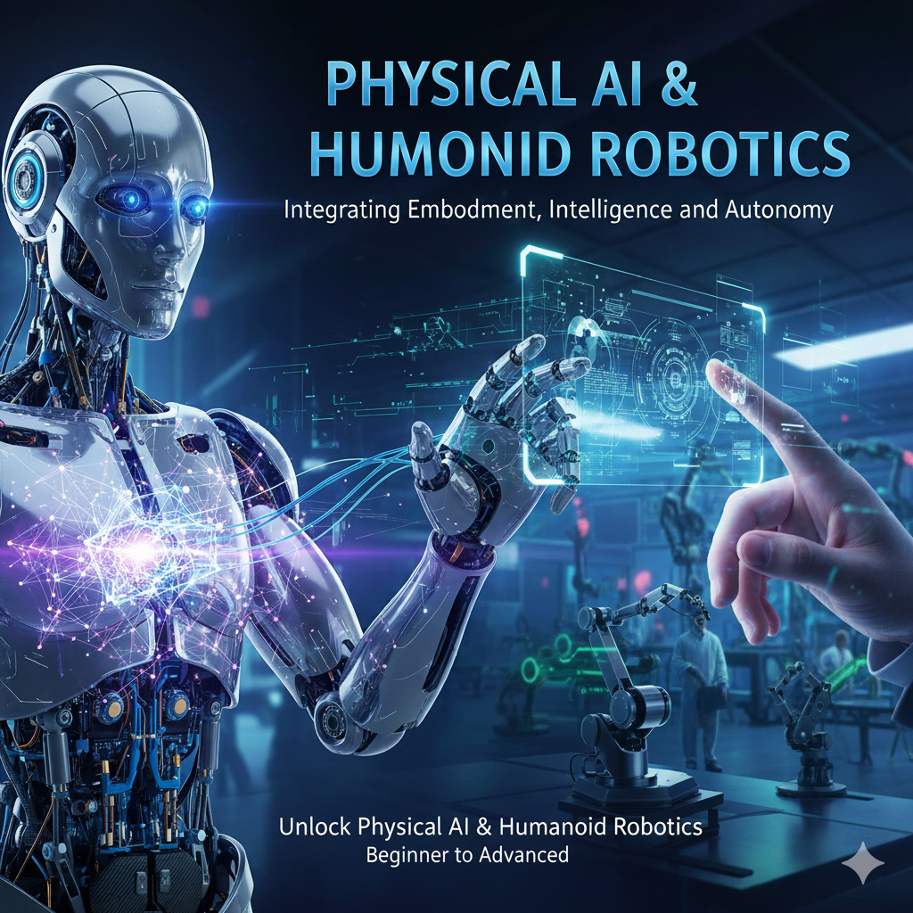

# 🤖 Physical AI & Humanoid Robotics Textbook

[](https://opensource.org/licenses/MIT)
[](https://docusaurus.io/)
[](https://fastapi.tiangolo.com/)
[](https://www.python.org/)
[](https://www.typescriptlang.org/)

> **An interactive online textbook exploring the frontier where artificial intelligence meets physical embodiment — from fundamentals to advanced applications.**



---

## 📚 About This Project

This project is a comprehensive educational platform that teaches Physical AI and Humanoid Robotics concepts through an interactive online textbook. It features:

- **📖 3 Complete Chapters** covering Physical AI fundamentals, workforce transformation, and humanoid robotics
- **🤖 AI-Powered Chatbot** that answers questions based on textbook content using RAG (Retrieval-Augmented Generation)
- **🔐 User Authentication** with email/password and Google OAuth support
- **📱 Responsive Design** optimized for desktop and mobile devices
- **🎨 Dark Theme** modern UI with excellent readability

---

## 🏗️ Project Structure

```
physical-ai-humaniod-robotics/
├── 📁 backend/                 # FastAPI backend server
│   ├── src/
│   │   ├── chatbot/           # AI chatbot with RAG
│   │   ├── routers/           # API endpoints
│   │   ├── models/            # Database models
│   │   ├── services/          # Business logic
│   │   └── main.py            # FastAPI application
│   ├── scripts/               # Data ingestion scripts
│   └── tests/                 # Backend tests
│
├── 📁 book-source/            # Docusaurus frontend
│   ├── docs/                  # Textbook content (MDX)
│   │   ├── chapter-01/        # The Rise of Physical AI
│   │   ├── chapter-02/        # Humans, Agents & Robots
│   │   └── chapter-03/        # AI & Humanoid Robots
│   ├── src/
│   │   ├── components/        # React components
│   │   ├── pages/             # Custom pages
│   │   ├── hooks/             # Custom React hooks
│   │   └── contexts/          # React contexts
│   └── static/                # Static assets
│
├── 📁 specs/                  # Feature specifications
└── 📁 history/                # Development history
```

---

## ✨ Features

### 📖 Interactive Textbook
- **Chapter 1: The Rise of Physical AI** - Understanding the convergence of AI and physical systems
- **Chapter 2: Humans, Agents & Robots** - Exploring the future workforce dynamics
- **Chapter 3: AI & Humanoid Robots** - Deep dive into humanoid robotics technology

### 🤖 AI Assistant Chatbot
- **Context-Aware Responses** - Answers questions using textbook content
- **RAG Architecture** - Powered by OpenAI GPT-4 and Qdrant vector database
- **Streaming Responses** - Real-time response generation
- **Text Selection** - Select text and ask the AI about it

### 🔐 Authentication System
- Email/Password registration with verification
- Google OAuth single sign-on
- Secure JWT token-based sessions
- User profile with experience level tracking

### 🎨 Modern UI/UX
- Dark theme optimized for reading
- Mobile-responsive design
- Smooth animations and transitions
- Accessible navigation

---

## 🚀 Quick Start

### Prerequisites

- **Node.js** 18+ and npm
- **Python** 3.11+
- **uv** (Python package manager) - `pip install uv`

### 1️⃣ Clone the Repository

```bash
git clone https://github.com/ahmergit/hackathon-physical-ai-textbook.git
cd hackathon-physical-ai-textbook
```

### 2️⃣ Backend Setup

```bash
cd backend

# Create virtual environment and install dependencies
uv venv
uv pip install -r requirements.txt

# Copy and configure environment variables
cp .env.example .env
# Edit .env with your API keys (OpenAI, Qdrant, etc.)

# Run database migrations
uv run alembic upgrade head

# Start the backend server
uv run uvicorn src.main:app --reload --port 8000
```

### 3️⃣ Frontend Setup

```bash
cd book-source

# Install dependencies
npm install

# Start the development server
npm start
```

### 4️⃣ Access the Application

- **Frontend**: http://localhost:3000/physical-ai-humaniod-robotics/
- **Backend API**: http://localhost:8000
- **API Docs**: http://localhost:8000/docs

---

## ⚙️ Environment Variables

### Backend (`backend/.env`)

```env
# Database
DATABASE_URL=sqlite:///./physical_ai.db

# JWT Authentication
JWT_SECRET_KEY=your-secret-key-here
JWT_ALGORITHM=HS256
ACCESS_TOKEN_EXPIRE_MINUTES=30

# OpenAI (for chatbot)
OPENAI_API_KEY=sk-your-openai-key

# Qdrant (vector database)
QDRANT_URL=https://your-qdrant-instance.cloud
QDRANT_API_KEY=your-qdrant-api-key
QDRANT_COLLECTION_NAME=physical-ai-textbook

# Google OAuth (optional)
GOOGLE_CLIENT_ID=your-google-client-id
GOOGLE_CLIENT_SECRET=your-google-client-secret

# CORS
CORS_ORIGINS=http://localhost:3000,http://127.0.0.1:3000
```

---

## 📡 API Endpoints

### Authentication
| Method | Endpoint | Description |
|--------|----------|-------------|
| POST | `/api/auth/register` | Register new user |
| POST | `/api/auth/login` | Login user |
| GET | `/api/auth/me` | Get current user |

### Profile
| Method | Endpoint | Description |
|--------|----------|-------------|
| GET | `/api/profile` | Get user profile |
| POST | `/api/profile` | Create profile |
| PUT | `/api/profile` | Update profile |

### Chat
| Method | Endpoint | Description |
|--------|----------|-------------|
| POST | `/api/chat` | Send chat message (SSE streaming) |
| GET | `/api/chat/health` | Check chatbot health |

---

## 🧪 Testing

### Backend Tests
```bash
cd backend
uv run pytest
```

### Frontend Tests
```bash
cd book-source
npm test
```

### E2E Tests
```bash
cd book-source
npx playwright test
```

---

## 📖 Textbook Content

### Chapter 1: The Rise of Physical AI
1. Introduction to Physical AI
2. Key Components of Physical AI
3. Real-World Applications
4. Challenges & Limitations
5. The Future of Physical AI

### Chapter 2: Humans, Agents & Robots
1. The New Partnership Paradigm
2. Essential Human Capabilities
3. The Emergence of Hybrid Roles
4. Economic Transformations
5. Preparing for the Integrated Workforce

### Chapter 3: AI & Humanoid Robots
1. Why Humanoid Robots Matter Today & Tomorrow
2. Automation & Flexibility
3. Service & Care
4. Challenges & Ethics
5. Future Skills

---

## 🛠️ Tech Stack

### Frontend
- **Docusaurus 3.9** - Static site generator
- **React 18** - UI library
- **TypeScript** - Type safety
- **CSS Modules** - Styling

### Backend
- **FastAPI** - Modern Python web framework
- **SQLAlchemy** - ORM
- **Alembic** - Database migrations
- **Pydantic** - Data validation

### AI/ML
- **OpenAI GPT-4** - Language model
- **Qdrant** - Vector database
- **LangChain** - LLM orchestration

### Infrastructure
- **SQLite** - Database (development)
- **JWT** - Authentication tokens
- **SSE** - Real-time streaming

---

## 🤝 Contributing

We welcome contributions! Please see our [Contributing Guide](book-source/CONTRIBUTING.md) for details.

1. Fork the repository
2. Create your feature branch (`git checkout -b feature/amazing-feature`)
3. Commit your changes (`git commit -m 'Add amazing feature'`)
4. Push to the branch (`git push origin feature/amazing-feature`)
5. Open a Pull Request

---

## 📄 License

This project is licensed under the MIT License - see the [LICENSE](LICENSE) file for details.

---

## 👥 Team

Built with ❤️ for the Hackathon 2025

---

## 🙏 Acknowledgments

- [Docusaurus](https://docusaurus.io/) - Amazing documentation framework
- [FastAPI](https://fastapi.tiangolo.com/) - Modern Python web framework
- [OpenAI](https://openai.com/) - AI language models
- [Qdrant](https://qdrant.tech/) - Vector search engine

---

<p align="center">
  <b>Physical AI & Humanoid Robotics: From Fundamentals to Advanced Applications</b>
  <br>
  <sub>Bridging the gap between artificial intelligence and physical embodiment</sub>
</p>
