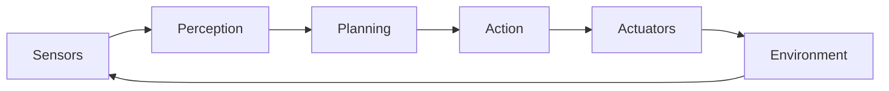
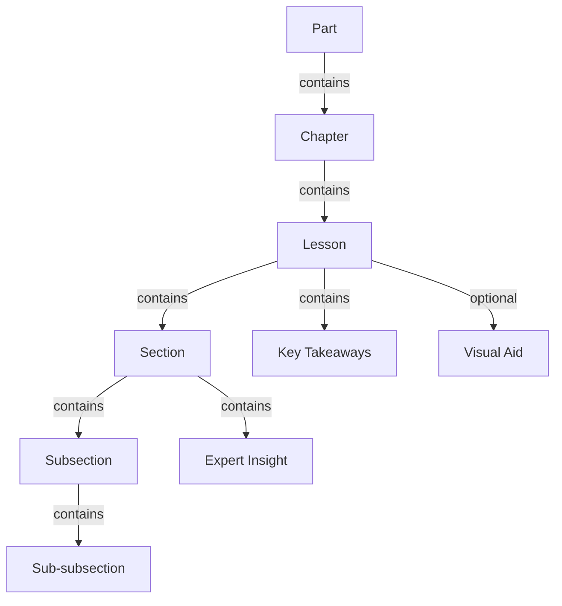

# Data Model: Chapter 1 - Physical AI

**Feature**: 001-chapter-1-physical-ai
**Date**: 2025-11-28
**Status**: Complete

## Overview

This document defines the content entities, their structure, relationships, and validation rules for Chapter 1 of the Physical AI book. All entities are represented as Markdown files with structured frontmatter and content sections.

---

## Entity Definitions

### 1. Part

**Description**: Top-level organizational unit grouping multiple chapters.

**Structure**: Directory with `_category_.json` configuration.

**Attributes**:
- `label` (string, required): Human-readable part name
- `position` (integer, required): Order in sidebar (1-indexed)
- `collapsible` (boolean, required): Whether category can collapse
- `collapsed` (boolean, required): Default collapsed state
- `link` (object, optional): Custom link configuration

**File Location**: `/docs/part-01/_category_.json`

**Example**:
```json
{
  "label": "Part 1: Foundations of Physical AI",
  "position": 1,
  "collapsible": true,
  "collapsed": false,
  "link": {
    "type": "generated-index",
    "description": "Introduction to Physical AI and embodied intelligence fundamentals."
  }
}
```

**Validation Rules**:
- `position` must be unique across all parts
- `label` must not exceed 60 characters
- Directory name must match pattern `part-{NN}` where NN is zero-padded number

**Relationships**:
- Contains: 1 or more **Chapter** entities
- Parent: None (top-level)

---

### 2. Chapter

**Description**: Major thematic unit containing multiple lessons on a related topic.

**Structure**: Directory with `_category_.json` configuration and optional `index.md`.

**Attributes**:
- `label` (string, required): Human-readable chapter name
- `position` (integer, required): Order within part (1-indexed)
- `collapsible` (boolean, required): Whether category can collapse
- `collapsed` (boolean, required): Default collapsed state
- `link` (object, optional): Custom link configuration
- `description` (string, optional): Chapter summary for generated index

**File Location**: `/docs/part-01/chapter-01/_category_.json`

**Example**:
```json
{
  "label": "Chapter 1: The Rise of Physical AI",
  "position": 1,
  "collapsible": true,
  "collapsed": false,
  "link": {
    "type": "generated-index",
    "description": "Explore the foundations of Physical AI: from digital to embodied intelligence."
  }
}
```

**Validation Rules**:
- `position` must be unique within parent part
- `label` must not exceed 80 characters
- Directory name must match pattern `chapter-{NN}` where NN is zero-padded number
- Must contain at least 1 **Lesson** entity

**Relationships**:
- Parent: **Part** (1:1)
- Contains: 1 or more **Lesson** entities

---

### 3. Lesson

**Description**: Self-contained learning module with introduction, 3-5 sections, examples, and key takeaways.

**Structure**: Markdown file with YAML frontmatter and MDX content.

**Frontmatter Attributes**:
- `sidebar_position` (integer, required): Order within chapter (1-indexed)
- `title` (string, optional): Overrides H1 heading in sidebar
- `description` (string, optional): Meta description for SEO
- `keywords` (array of strings, optional): SEO keywords
- `slug` (string, optional): Custom URL slug

**File Location**: `/docs/part-01/chapter-01/lesson-{NN}.md`

**Content Structure**:
```markdown
---
sidebar_position: 1
description: "Introduction to Physical AI and why it represents the next frontier"
keywords: ["physical ai", "embodied intelligence", "robotics"]
---

import SummaryButton from '@site/src/components/SummaryButton';
import PersonalizeButton from '@site/src/components/PersonalizeButton';

# Lesson Title

<SummaryButton lessonId="lesson-01" />
<PersonalizeButton lessonId="lesson-01" />

## Introduction
[100-150 words]

## Main Section 1
### Subheading 1.1
#### Sub-subheading 1.1.1
#### Sub-subheading 1.1.2
### Subheading 1.2

:::tip Expert Insight
[4-line expert insight for Section 1]
:::

## Main Section 2
### Subheading 2.1
### Subheading 2.2

:::tip Expert Insight
[4-line expert insight for Section 2]
:::

## Main Section 3
### Subheading 3.1
### Subheading 3.2

:::tip Expert Insight
[4-line expert insight for Section 3]
:::

## Key Takeaways
[100-150 words, bullet points]
```

**Validation Rules**:
- **Word count**: 900-1100 words (excluding frontmatter, component imports, admonitions)
- **Heading hierarchy**: Must have exactly 1 H1, at least 3 H2 (sections), 2 H3 per H2 (subheadings)
- **Expert insights**: Exactly 3 admonitions (:::tip), one per main section
- **Imports**: Must import SummaryButton and PersonalizeButton at top
- **File name**: Must match pattern `lesson-{NN}.md` where NN is zero-padded
- **Sidebar position**: Must be unique within chapter

**Relationships**:
- Parent: **Chapter** (1:1)
- Contains: 3-5 **Section** entities
- Contains: 3 **Expert Insight** entities
- Contains: 1 **Key Takeaways** section

---

### 4. Section

**Description**: Major thematic division within a lesson (H2 level).

**Structure**: Markdown heading (H2) with body content and subheadings.

**Attributes** (implicit in Markdown):
- `heading` (string, required): H2 text
- `content` (markdown, required): Body paragraphs
- `subheadings` (array of **Subsection**, required): 2 or more H3 headings
- `expert_insight` (string, required): 4-line tip/info admonition

**Example**:
```markdown
## Definition and Scope

### What is Physical AI?
Physical AI refers to artificial intelligence systems that...

### Key Characteristics
Physical AI systems exhibit three core properties...

:::tip Expert Insight
Understanding the definition of Physical AI is crucial for distinguishing it from
purely digital systems. The key differentiator is the physical embodiment and
real-world interaction, which introduces constraints and opportunities absent in
software-only AI.
:::
```

**Validation Rules**:
- Heading text must not exceed 60 characters
- Must contain at least 2 **Subsection** entities (H3)
- Must be followed by exactly 1 expert insight admonition
- Content (excluding subheadings) should be 150-200 words

**Relationships**:
- Parent: **Lesson** (1:1)
- Contains: 2 or more **Subsection** entities
- Contains: 1 **Expert Insight** entity

---

### 5. Subsection

**Description**: Detailed breakdown of section topics (H3 level).

**Structure**: Markdown heading (H3) with body content and optional sub-subheadings.

**Attributes** (implicit in Markdown):
- `heading` (string, required): H3 text
- `content` (markdown, required): Body paragraphs
- `sub_subheadings` (array of **Sub-subsection**, optional): 0-2 H4 headings

**Example**:
```markdown
### What is Physical AI?

#### Core Components
Physical AI systems integrate sensors, actuators, and...

#### Interaction Paradigm
Unlike traditional AI, Physical AI must reason about...
```

**Validation Rules**:
- Heading text must not exceed 80 characters
- May contain 0-2 **Sub-subsection** entities (H4)
- Content should be 50-100 words

**Relationships**:
- Parent: **Section** (1:1)
- Contains: 0-2 **Sub-subsection** entities

---

### 6. Sub-subsection

**Description**: Granular topic detail (H4 level).

**Structure**: Markdown heading (H4) with body content.

**Attributes** (implicit in Markdown):
- `heading` (string, required): H4 text
- `content` (markdown, required): Body paragraphs

**Example**:
```markdown
#### Core Components
Sensors provide environmental data, actuators enable movement...
```

**Validation Rules**:
- Heading text must not exceed 100 characters
- Content should be 30-50 words
- No further nesting (no H5)

**Relationships**:
- Parent: **Subsection** (1:1)

---

### 7. Expert Insight

**Description**: Highlighted commentary explaining significance of a section.

**Structure**: Docusaurus admonition (:::tip or :::info).

**Attributes**:
- `type` (enum, required): "tip" or "info"
- `content` (markdown, required): 4-line explanation (60-80 words)

**Example**:
```markdown
:::tip Expert Insight
Understanding the definition of Physical AI is crucial for distinguishing it from
purely digital systems. The key differentiator is the physical embodiment and
real-world interaction, which introduces constraints and opportunities absent in
software-only AI.
:::
```

**Validation Rules**:
- Must use `:::tip` or `:::info` syntax
- Content must be 4 lines (approximately 60-80 words)
- Must appear immediately after the last subsection of a main section
- Exactly 3 per lesson (1 per main section)

**Relationships**:
- Parent: **Section** (1:1)

---

### 8. Key Takeaways

**Description**: Summary section at end of lesson highlighting essential concepts.

**Structure**: Markdown heading (H2) with bullet list.

**Attributes** (implicit in Markdown):
- `heading` (string, required): "Key Takeaways" (standardized)
- `items` (array of markdown list items, required): 3-5 bullet points

**Example**:
```markdown
## Key Takeaways

- Physical AI combines artificial intelligence with physical embodiment
- Sensorimotor grounding differentiates it from digital-only AI
- Modern systems use vision-language-action models
- The Perception → Planning → Action pipeline is foundational
- Traditional robotics methods lacked adaptability and learning
```

**Validation Rules**:
- Heading must be exactly "Key Takeaways" (H2)
- Must contain 3-5 bullet points (unordered list)
- Each bullet point should be 10-20 words
- Total word count: 100-150 words
- Must be the last section of the lesson (before any footnotes)

**Relationships**:
- Parent: **Lesson** (1:1)

---

### 9. Visual Aid

**Description**: Diagram or image enhancing understanding of concepts.

**Structure**: Mermaid diagram (code block) or image reference (Markdown).

**Attributes**:
- `type` (enum, required): "mermaid" or "image"
- `alt_text` (string, required for images): Accessibility description
- `caption` (string, optional): Explanatory text below visual
- `source` (string, required for images): Path to image file

**Example (Mermaid)**:
```markdown
### The Perception-Planning-Action Loop



*Figure 1: The continuous feedback loop of embodied AI systems.*
```

**Example (Image)**:
```markdown
### Historical Evolution


*Figure 2: Major milestones in the evolution of AI toward physical embodiment.*
```

**Validation Rules**:
- Mermaid diagrams must use valid Mermaid syntax
- Images must exist in `/static/img/` directory
- Alt text required for accessibility (WCAG AA)
- Caption (markdown italic) recommended for context
- Maximum 2 visual aids per lesson

**Relationships**:
- Parent: **Section** or **Subsection** (optional, 0-2 per lesson)

---

## Entity Relationships Diagram



---

## Derived Entities (Components)

### 10. SummaryButton Component

**Description**: React component displaying AI-generated lesson summary.

**Type**: Interactive UI component (not content entity).

**Props**:
```typescript
interface SummaryButtonProps {
  lessonId: string;          // e.g., "lesson-01"
  title?: string;            // Optional custom button text
  className?: string;        // Optional CSS class
}
```

**State**:
- `isOpen` (boolean): Whether summary panel is visible
- `summary` (string | null): Generated summary text (mock data initially)

**Example Usage**:
```tsx
<SummaryButton lessonId="lesson-01" title="Show Summary" />
```

**Validation Rules**:
- `lessonId` must match pattern `lesson-{NN}`
- Must be placed immediately after H1 heading

---

### 11. PersonalizeButton Component

**Description**: React component adapting lesson content for user skill level.

**Type**: Interactive UI component (not content entity).

**Props**:
```typescript
interface PersonalizeButtonProps {
  lessonId: string;          // e.g., "lesson-01"
  levels?: string[];         // Default: ["Beginner", "Intermediate", "Advanced"]
  className?: string;        // Optional CSS class
}
```

**State**:
- `selectedLevel` (string): Current user level ("Beginner" | "Intermediate" | "Advanced")
- `isPersonalized` (boolean): Whether content is adapted

**Example Usage**:
```tsx
<PersonalizeButton lessonId="lesson-01" />
```

**Validation Rules**:
- `lessonId` must match pattern `lesson-{NN}`
- Must be placed immediately after SummaryButton

---

## Content Schema (YAML)

### Lesson Frontmatter Schema

```yaml
sidebar_position: integer (1-99, required)
description: string (max 160 chars, optional)
keywords: array of strings (optional)
slug: string (optional, kebab-case)
title: string (optional, max 80 chars)
```

### Category Configuration Schema

```json
{
  "label": "string (required, max 80 chars)",
  "position": "integer (required, 1-99)",
  "collapsible": "boolean (required)",
  "collapsed": "boolean (required)",
  "link": {
    "type": "string (optional, 'generated-index' or 'doc')",
    "description": "string (optional, max 200 chars)"
  }
}
```

---

## Validation Rules Summary

| Entity | Word Count | Heading Levels | Required Components |
|--------|-----------|---------------|---------------------|
| Lesson | 900-1100 | H1 (1), H2 (3-5), H3 (2+ per H2) | Intro, 3 Sections, Key Takeaways |
| Section | 150-200 | H2 (1), H3 (2+) | 1 Expert Insight |
| Subsection | 50-100 | H3 (1), H4 (0-2) | None |
| Sub-subsection | 30-50 | H4 (1) | None |
| Expert Insight | 60-80 | N/A (admonition) | None |
| Key Takeaways | 100-150 | H2 (1), bullets (3-5) | None |

---

## File Naming Conventions

| Entity | Pattern | Example |
|--------|---------|---------|
| Part | `part-{NN}/` | `part-01/` |
| Chapter | `chapter-{NN}/` | `chapter-01/` |
| Lesson | `lesson-{NN}.md` | `lesson-01.md` |
| Category Config | `_category_.json` | `_category_.json` |
| Component | `PascalCase.tsx` | `SummaryButton.tsx` |
| Image | `kebab-case.{svg,png}` | `evolution-timeline.svg` |

---

## State Transitions

**Lesson Lifecycle**:
1. **Draft**: Markdown file created with frontmatter
2. **Content**: Sections and subsections written
3. **Review**: Word count, heading structure, and insights validated
4. **Complete**: Integrated into chapter, sidebar generated
5. **Published**: Built and deployed via Docusaurus

---

## Constraints

1. **Maximum nesting**: H1 → H2 → H3 → H4 (no H5 or deeper)
2. **Minimum sections**: 3 main sections (H2) per lesson
3. **Expert insights**: Exactly 3 per lesson (1 per main section)
4. **Visual aids**: Maximum 2 per lesson
5. **Word count tolerance**: ±50 words from target (850-1150 acceptable)

---

## Future Extensions

**Potential Entities** (out of scope for Chapter 1):
- **Quiz**: Multiple-choice questions for comprehension testing
- **Exercise**: Hands-on coding or design challenges
- **Reference**: Bibliography or external resource links
- **Glossary**: Term definitions for technical vocabulary

---

**Status**: ✅ Data model complete and validated
**Next**: Create API contracts for React components
