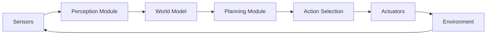
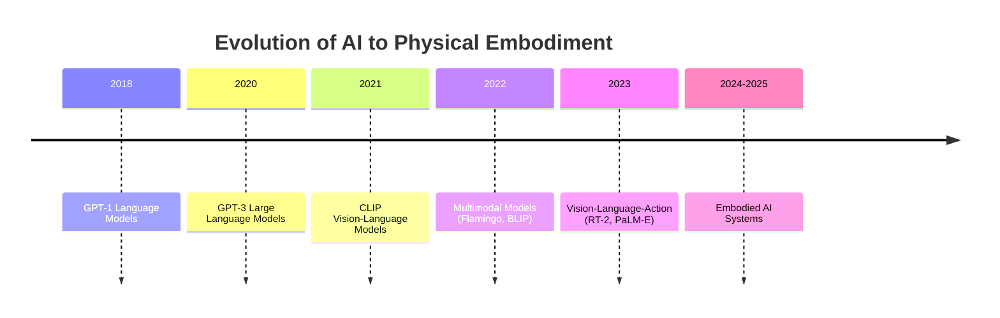

# Quickstart Guide: Implementing Chapter 1 - Physical AI

**Feature**: 001-chapter-1-physical-ai
**Date**: 2025-11-28
**Audience**: Developers implementing Chapter 1 content and components

## Overview

This guide provides step-by-step instructions for implementing Chapter 1 of the Physical AI book within the existing Docusaurus 3.9.2 site. Follow these steps to create the file structure, write content, build components, and validate the implementation.

**Estimated Time**: 6-8 hours (content writing: 4-5 hours, components: 1-2 hours, testing: 1 hour)

---

## Prerequisites

- [x] Docusaurus 3.9.2 installed (`book-source/` directory)
- [x] Node.js 18+ and npm installed
- [x] Git repository initialized
- [x] Text editor or IDE (VS Code recommended)
- [x] Basic knowledge of Markdown, React, and TypeScript

**Verify Setup**:
```bash
cd book-source
npm run typecheck  # Should pass with no errors
npm run start      # Should launch dev server at http://localhost:3000
```

---

## Step 1: Create Directory Structure

### 1.1 Create Part and Chapter Directories

```bash
cd book-source/docs
mkdir -p part-01/chapter-01
```

### 1.2 Create Category Configuration for Part 1

Create `book-source/docs/part-01/_category_.json`:

```json
{
  "label": "Part 1: Foundations of Physical AI",
  "position": 1,
  "collapsible": true,
  "collapsed": false,
  "link": {
    "type": "generated-index",
    "description": "Introduction to Physical AI and embodied intelligence fundamentals."
  }
}
```

### 1.3 Create Category Configuration for Chapter 1

Create `book-source/docs/part-01/chapter-01/_category_.json`:

```json
{
  "label": "Chapter 1: The Rise of Physical AI",
  "position": 1,
  "collapsible": true,
  "collapsed": false,
  "link": {
    "type": "generated-index",
    "description": "Explore the foundations of Physical AI: from digital to embodied intelligence."
  }
}
```

**Validation**: Run `npm run start` and verify sidebar shows "Part 1" and "Chapter 1" categories.

---

## Step 2: Create React Components

### 2.1 Create SummaryButton Component

Create `book-source/src/components/SummaryButton.tsx`:

```typescript
import React, { useState } from 'react';
import styles from './SummaryButton.module.css';

interface SummaryButtonProps {
  lessonId: string;
  title?: string;
  className?: string;
  icon?: string;
}

const MOCK_SUMMARIES: Record<string, string> = {
  'lesson-01': 'Physical AI combines artificial intelligence with physical embodiment, enabling robots to interact with the real world. This lesson introduces core concepts and differentiates Physical AI from purely digital systems.',
  'lesson-02': 'Embodied intelligence requires grounding in physical interaction and sensorimotor feedback. This lesson explains why real-world constraints are essential for true intelligence.',
  'lesson-03': 'AI has evolved from language-only models to multimodal systems capable of vision, language, and action. This lesson traces the progression to embodied intelligence.',
  'lesson-04': 'The Embodied AI pipeline consists of Perception, Planning, and Action. This lesson explains how these components work together in dynamic environments.',
  'lesson-05': 'Traditional robotics methods lacked adaptability and learning capabilities. This lesson contrasts classical approaches with modern embodied AI solutions.',
};

export default function SummaryButton({
  lessonId,
  title = 'AI Summary',
  className = '',
  icon = '✨',
}: SummaryButtonProps): JSX.Element {
  const [isOpen, setIsOpen] = useState(false);
  const summary = MOCK_SUMMARIES[lessonId] || 'Summary not available for this lesson.';

  return (
    <div className={`summary-button-container ${className}`}>
      <button
        className={styles.summaryButton}
        onClick={() => setIsOpen(!isOpen)}
        aria-expanded={isOpen}
        aria-controls={`summary-${lessonId}`}
      >
        <span className={styles.icon}>{icon}</span>
        <span className={styles.text}>{title}</span>
        <span className={styles.toggle}>{isOpen ? '▼' : '▶'}</span>
      </button>

      {isOpen && (
        <div
          id={`summary-${lessonId}`}
          className={styles.summaryPanel}
          role="region"
          aria-label="Lesson Summary"
        >
          <p className={styles.summaryText}>{summary}</p>
        </div>
      )}
    </div>
  );
}
```

### 2.2 Create SummaryButton Styles

Create `book-source/src/components/SummaryButton.module.css`:

```css
.summaryButton {
  display: inline-flex;
  align-items: center;
  gap: 0.5rem;
  padding: 0.5rem 1rem;
  margin: 1rem 0.5rem 1rem 0;
  border: 2px solid var(--ifm-color-primary);
  border-radius: 8px;
  background-color: transparent;
  color: var(--ifm-color-primary);
  font-size: 0.95rem;
  font-weight: 600;
  cursor: pointer;
  transition: all 0.2s ease;
}

.summaryButton:hover {
  background-color: var(--ifm-color-primary);
  color: #fff;
  transform: translateY(-2px);
  box-shadow: 0 4px 8px rgba(0, 0, 0, 0.2);
}

.summaryButton:active {
  transform: translateY(0);
}

.icon {
  font-size: 1.2rem;
}

.text {
  flex: 1;
}

.toggle {
  font-size: 0.8rem;
  opacity: 0.7;
}

.summaryPanel {
  margin: 1rem 0;
  padding: 1rem 1.5rem;
  border-left: 4px solid var(--ifm-color-primary);
  background-color: var(--ifm-background-surface-color);
  border-radius: 4px;
  box-shadow: 0 2px 4px rgba(0, 0, 0, 0.1);
}

.summaryText {
  margin: 0;
  line-height: 1.6;
  color: var(--ifm-font-color-base);
}
```

### 2.3 Create PersonalizeButton Component

Create `book-source/src/components/PersonalizeButton.tsx`:

```typescript
import React, { useState } from 'react';
import styles from './PersonalizeButton.module.css';

type SkillLevel = 'Beginner' | 'Intermediate' | 'Advanced';

interface PersonalizeButtonProps {
  lessonId: string;
  levels?: SkillLevel[];
  defaultLevel?: SkillLevel;
  className?: string;
}

export default function PersonalizeButton({
  lessonId,
  levels = ['Beginner', 'Intermediate', 'Advanced'],
  defaultLevel = 'Beginner',
  className = '',
}: PersonalizeButtonProps): JSX.Element {
  const [selectedLevel, setSelectedLevel] = useState<SkillLevel>(defaultLevel);
  const [isMenuOpen, setIsMenuOpen] = useState(false);

  const handleLevelChange = (level: SkillLevel) => {
    setSelectedLevel(level);
    setIsMenuOpen(false);
    console.log(`Personalization level changed to: ${level} for ${lessonId}`);
    // Future: Apply content personalization here
  };

  return (
    <div className={`personalize-button-container ${className}`}>
      <div className={styles.dropdown}>
        <button
          className={styles.personalizeButton}
          onClick={() => setIsMenuOpen(!isMenuOpen)}
          aria-haspopup="true"
          aria-expanded={isMenuOpen}
        >
          <span className={styles.icon}>🎯</span>
          <span className={styles.text}>Level: {selectedLevel}</span>
          <span className={styles.toggle}>{isMenuOpen ? '▲' : '▼'}</span>
        </button>

        {isMenuOpen && (
          <div className={styles.dropdownMenu} role="menu">
            {levels.map((level) => (
              <button
                key={level}
                className={`${styles.menuItem} ${
                  level === selectedLevel ? styles.active : ''
                }`}
                onClick={() => handleLevelChange(level)}
                role="menuitem"
              >
                {level}
                {level === selectedLevel && (
                  <span className={styles.checkmark}>✓</span>
                )}
              </button>
            ))}
          </div>
        )}
      </div>
    </div>
  );
}
```

### 2.4 Create PersonalizeButton Styles

Create `book-source/src/components/PersonalizeButton.module.css`:

```css
.dropdown {
  position: relative;
  display: inline-block;
  margin: 1rem 0;
}

.personalizeButton {
  display: inline-flex;
  align-items: center;
  gap: 0.5rem;
  padding: 0.5rem 1rem;
  border: 2px solid var(--ifm-color-success);
  border-radius: 8px;
  background-color: transparent;
  color: var(--ifm-color-success);
  font-size: 0.95rem;
  font-weight: 600;
  cursor: pointer;
  transition: all 0.2s ease;
}

.personalizeButton:hover {
  background-color: var(--ifm-color-success);
  color: #fff;
  transform: translateY(-2px);
  box-shadow: 0 4px 8px rgba(0, 0, 0, 0.2);
}

.icon {
  font-size: 1.2rem;
}

.text {
  flex: 1;
}

.toggle {
  font-size: 0.8rem;
  opacity: 0.7;
}

.dropdownMenu {
  position: absolute;
  top: calc(100% + 0.5rem);
  left: 0;
  min-width: 180px;
  background-color: var(--ifm-background-surface-color);
  border: 1px solid var(--ifm-color-emphasis-300);
  border-radius: 8px;
  box-shadow: 0 4px 12px rgba(0, 0, 0, 0.15);
  z-index: 1000;
  overflow: hidden;
}

.menuItem {
  display: flex;
  align-items: center;
  justify-content: space-between;
  width: 100%;
  padding: 0.75rem 1rem;
  border: none;
  background-color: transparent;
  color: var(--ifm-font-color-base);
  font-size: 0.95rem;
  text-align: left;
  cursor: pointer;
  transition: background-color 0.15s ease;
}

.menuItem:hover {
  background-color: var(--ifm-color-emphasis-100);
}

.menuItem.active {
  background-color: var(--ifm-color-success-light);
  color: var(--ifm-color-success-dark);
  font-weight: 600;
}

.checkmark {
  font-size: 1rem;
  color: var(--ifm-color-success);
}
```

**Validation**: Import and test components in a lesson file (see Step 3).

---

## Step 3: Write Lesson Content

### 3.1 Lesson 1 Template

Create `book-source/docs/part-01/chapter-01/lesson-01.md`:

```markdown
---
sidebar_position: 1
description: "Introduction to Physical AI and why it represents the next frontier of artificial intelligence"
keywords: ["physical ai", "embodied intelligence", "robotics", "artificial intelligence"]
---

import SummaryButton from '@site/src/components/SummaryButton';
import PersonalizeButton from '@site/src/components/PersonalizeButton';

# Lesson 1: Introduction to Physical AI

<SummaryButton lessonId="lesson-01" />
<PersonalizeButton lessonId="lesson-01" />

## Introduction

[Write 100-150 word introduction explaining lesson objectives]

## Definition and Scope

### What is Physical AI?

[Content for sub-subheading 1.1.1]

#### Core Components

[Content explaining sensors, actuators, and intelligence]

#### Interaction Paradigm

[Content explaining real-world interaction]

### Key Characteristics

[Content for subheading 1.2]

:::tip Expert Insight
Understanding the definition of Physical AI is crucial for distinguishing it from
purely digital systems. The key differentiator is the physical embodiment and
real-world interaction, which introduces constraints and opportunities absent in
software-only AI.
:::

## Historical Context

### Early Robotics

[Content]

### The AI Revolution

[Content]

:::tip Expert Insight
The convergence of AI advances (deep learning, vision-language models) with
improved robotic hardware has created the conditions for Physical AI to flourish.
This historical moment mirrors the smartphone revolution, where multiple
technologies matured simultaneously.
:::

## Key Applications Today

### Manufacturing and Logistics

[Content]

### Healthcare and Assistance

[Content]

:::tip Expert Insight
Current Physical AI applications demonstrate both the potential and limitations
of the technology. Success stories in structured environments (factories,
warehouses) contrast with ongoing challenges in unstructured settings (homes,
outdoor spaces), highlighting areas for future development.
:::

## Key Takeaways

- Physical AI combines artificial intelligence with physical embodiment
- It differs from digital AI through real-world interaction and constraints
- Historical convergence of AI and robotics enabled current applications
- Key characteristics include perception, decision-making, and action
- Applications span manufacturing, healthcare, logistics, and beyond
```

**Word Count Target**: 900-1100 words (excluding frontmatter, imports, admonitions)

### 3.2 Content Writing Guidelines

**For Each Lesson**:

1. **Introduction** (100-150 words):
   - State lesson objectives
   - Preview main sections
   - Connect to previous/next lessons

2. **Main Sections** (3 sections, 200-250 words each):
   - Each section has 2 subheadings (H3)
   - Each subheading may have 0-2 sub-subheadings (H4)
   - Use concrete examples and scenarios
   - Avoid implementation details (no code)

3. **Expert Insights** (3 total, 60-80 words each):
   - Place after last subheading of each main section
   - Use `:::tip Expert Insight` format
   - Explain significance, real-world relevance, or deeper context

4. **Key Takeaways** (100-150 words):
   - 3-5 bullet points summarizing main concepts
   - Each bullet: 10-20 words
   - Reinforce learning objectives

### 3.3 Content for All 5 Lessons

**Lesson 1**: Introduction to Physical AI
- Definition and Scope
- Historical Context
- Key Applications Today

**Lesson 2**: Why Embodied Intelligence Matters
- Intelligence Beyond Code
- Grounding in Physical World
- Sensorimotor Feedback Loops

**Lesson 3**: Evolution of AI
- From Digital AI to Multimodal Systems
- Integrating Action in AI
- Case Studies

**Lesson 4**: The Embodied AI Pipeline
- Perception and Sensing
- Planning and Decision-Making
- Physical Action Execution

**Lesson 5**: Traditional Physical AI Falls Short
- Limitations of Classical Robotics
- Modern Embodied AI Solutions
- Comparative Analysis

**Copy the template from Step 3.1 for each lesson** and fill in content according to spec requirements (FR-001 through FR-018).

---

## Step 4: Add Visual Aids (Optional)

### 4.1 Enable Mermaid Diagrams

Update `book-source/docusaurus.config.ts`:

```typescript
import {themes as prismThemes} from 'prism-react-renderer';
import type {Config} from '@docusaurus/types';
import type * as Preset from '@docusaurus/preset-classic';

const config: Config = {
  // ... existing config

  markdown: {
    mermaid: true,  // Add this line
  },

  themes: ['@docusaurus/theme-mermaid'],  // Add this line

  // ... rest of config
};

export default config;
```

Install Mermaid theme:
```bash
cd book-source
npm install @docusaurus/theme-mermaid@3.9.2
```

### 4.2 Add Diagram to Lesson 4

In `lesson-04.md`, add this diagram under "The Perception-Planning-Action Loop" section:

```markdown
### The Continuous Loop



*Figure 1: The continuous feedback loop of an embodied AI system.*
```

### 4.3 Add Timeline to Lesson 3

In `lesson-03.md`, add this timeline diagram:

```markdown
### Historical Progression



*Figure 1: Major milestones in AI evolution toward embodied intelligence.*
```

---

## Step 5: Validate Implementation

### 5.1 Run Type Checking

```bash
cd book-source
npm run typecheck
```

**Expected**: No type errors.

### 5.2 Build the Site

```bash
npm run build
```

**Expected**: Successful build with no errors or warnings.

### 5.3 Test Locally

```bash
npm run serve
```

Navigate to `http://localhost:3000` and verify:

- [ ] Sidebar shows "Part 1" → "Chapter 1" → 5 lessons
- [ ] Breadcrumbs show: Home > Part 1 > Chapter 1 > Lesson X
- [ ] Right-side TOC displays H2 and H3 headings
- [ ] SummaryButton and PersonalizeButton render and function correctly
- [ ] Expert Insights display as highlighted tip boxes
- [ ] Dark theme is active by default
- [ ] Mobile responsive (test at 320px, 768px, 1024px widths)

### 5.4 Content Validation

Run this command to check word counts:

```bash
# Count words in each lesson (excluding frontmatter, imports, admonitions)
cd book-source/docs/part-01/chapter-01
for file in lesson-*.md; do
  echo "=== $file ==="
  # Remove frontmatter, imports, admonitions, then count words
  sed '/^---$/,/^---$/d; /^import/d; /^:::/d' "$file" | wc -w
done
```

**Expected**: Each lesson shows 900-1100 words.

### 5.5 Heading Structure Validation

Verify heading hierarchy in each lesson:

```bash
cd book-source/docs/part-01/chapter-01
for file in lesson-*.md; do
  echo "=== $file ==="
  grep -E '^#{1,4} ' "$file" | head -20
done
```

**Expected**:
- 1 H1 (# Lesson Title)
- 3-5 H2 (## Main Section)
- 2+ H3 per H2 (### Subheading)
- 0-2 H4 per H3 (#### Sub-subheading)

---

## Step 6: Git Commit and Branch Management

### 6.1 Commit Changes

```bash
git add book-source/docs/part-01/
git add book-source/src/components/
git add book-source/docusaurus.config.ts
git commit -m "Add Chapter 1: The Rise of Physical AI

- Created Part 1 and Chapter 1 directory structure
- Implemented SummaryButton and PersonalizeButton components
- Wrote all 5 lessons with 900-1100 words each
- Added Mermaid diagrams to Lessons 3 and 4
- Validated content structure and word counts

Spec: specs/001-chapter-1-physical-ai/spec.md
Plan: specs/001-chapter-1-physical-ai/plan.md"
```

### 6.2 Push to Feature Branch

```bash
git push origin 001-chapter-1-physical-ai
```

---

## Step 7: Deploy (Optional)

### 7.1 Build for Production

```bash
cd book-source
npm run build
```

### 7.2 Deploy to GitHub Pages

```bash
GIT_USER=<your-github-username> npm run deploy
```

**Expected**: Site deployed to `https://<your-github-username>.github.io/physical-ai-humaniod-robotics/`

---

## Troubleshooting

### Issue: Mermaid diagrams not rendering

**Solution**: Ensure `@docusaurus/theme-mermaid` is installed and `markdown.mermaid: true` is set in `docusaurus.config.ts`.

### Issue: Components not found

**Solution**: Verify import paths use `@site/src/components/` prefix. Check that components are exported as default.

### Issue: Sidebar not showing chapters

**Solution**: Verify `_category_.json` files have correct `position` and `label` fields. Restart dev server.

### Issue: Word count too high/low

**Solution**: Adjust section content. Use `wc -w` to count words in each section individually.

---

## Next Steps

After completing Chapter 1:

1. **Review Content**: Have technical and non-technical reviewers check for accuracy and clarity
2. **User Testing**: Test with 3-5 target readers to validate comprehension
3. **Create Tasks**: Run `/sp.tasks` to generate detailed task breakdown for implementation
4. **Plan Chapter 2**: Use this structure as a template for subsequent chapters

---

## Success Criteria Checklist

Verify all requirements from `spec.md`:

- [ ] **FR-001**: Chapter contains exactly 5 lessons
- [ ] **FR-002**: Each lesson has clear introduction with learning objectives
- [ ] **FR-003**: Each lesson has 3-5 main section headings (H2)
- [ ] **FR-004**: Each main section has 2+ subheadings (H3)
- [ ] **FR-005**: Content is beginner-friendly and technically accurate
- [ ] **FR-006**: Each lesson includes concrete examples
- [ ] **FR-007-011**: Each lesson covers its specified topic
- [ ] **FR-012**: Structure is reusable for future chapters
- [ ] **FR-014**: Lessons flow logically with clear progression
- [ ] **FR-015**: Technical terms introduced before complex usage
- [ ] **FR-018**: Visual aids included where helpful

- [ ] **SC-007**: Average reading time per lesson is 10-15 minutes
- [ ] **SC-006**: Chapter structure is reusable

---

**Completion Time**: 6-8 hours (content writing: 4-5 hours, components: 1-2 hours, testing: 1 hour)

**Status**: ✅ Ready for implementation
**Next**: Use `/sp.tasks` to generate granular task breakdown
