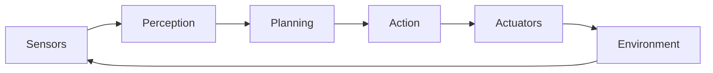

# Research & Technology Decisions: Chapter 1 - Physical AI

**Feature**: 001-chapter-1-physical-ai
**Date**: 2025-11-28
**Status**: Complete

## Purpose

This document captures all technology decisions, patterns, and research findings for implementing Chapter 1 of the Physical AI book within the Docusaurus 3.9.2 static site.

## Technology Stack Decisions

### 1. Static Site Generator: Docusaurus 3.9.2

**Decision**: Use Docusaurus 3.9.2 as the primary static site generator for the book.

**Rationale**:
- **Already installed and configured** in `book-source/` directory
- **React-based**: Enables interactive components (Summary, Personalize buttons)
- **Built-in documentation features**: Sidebar generation, TOC, breadcrumbs, search
- **Dark theme support**: Default dark mode with light mode toggle configured
- **MDX support**: Allows embedding React components within Markdown
- **Responsive by default**: Mobile-first design philosophy
- **Fast build times**: Optimized for static site generation
- **SEO-friendly**: Built-in meta tags, social cards, and sitemap generation

**Alternatives Considered**:
- **Gatsby**: More complex, overkill for documentation site
- **Next.js with Nextra**: Adds unnecessary SSR complexity
- **VitePress**: Vue-based, different ecosystem
- **Jekyll/Hugo**: Static generators without React component support

**Configuration Details**:
- Version: 3.9.2 (confirmed in package.json)
- Preset: @docusaurus/preset-classic
- Theme: Custom CSS with dark mode default
- Node version: 18+

---

### 2. Content Structure: Hierarchical Markdown Files

**Decision**: Organize content as `/docs/part-01/chapter-01/lesson-{01-05}.md` with Docusaurus auto-generated sidebars.

**Rationale**:
- **Docusaurus convention**: Aligns with `/docs/**/*.md` pattern
- **Auto-generated sidebar**: Sidebars.ts uses `{type: 'autogenerated', dirName: '.'}`
- **Hierarchical navigation**: Part → Chapter → Lesson naturally maps to folder structure
- **Breadcrumbs**: Docusaurus automatically generates Home > Part 1 > Chapter 1 > Lesson X
- **Maintainability**: Clear file organization, easy to locate and update lessons
- **Scalability**: Supports multiple parts and chapters without config changes

**Alternatives Considered**:
- **Flat file structure** (`/docs/chapter-01-lesson-01.md`): Harder to navigate at scale
- **Manual sidebar configuration**: Requires updating sidebars.ts for every lesson
- **Database-driven content**: Unnecessary complexity for static content

**File Naming Convention**:
```
docs/
├── part-01/
│   ├── chapter-01/
│   │   ├── lesson-01.md  (Introduction to Physical AI)
│   │   ├── lesson-02.md  (Why Embodied Intelligence Matters)
│   │   ├── lesson-03.md  (Evolution of AI)
│   │   ├── lesson-04.md  (Embodied AI Pipeline)
│   │   └── lesson-05.md  (Traditional Physical AI Falls Short)
```

---

### 3. Word Count Target: 900-1100 Words per Lesson

**Decision**: Each lesson targets 900-1100 words with structured headings.

**Rationale**:
- **Reading time**: 10-15 minutes per lesson (aligned with SC-007 success criteria)
- **Depth vs. brevity**: Sufficient for technical depth while remaining accessible
- **Engagement**: Prevents reader fatigue common with longer content
- **Consistency**: Uniform lesson length creates predictable learning experience

**Word Budget Breakdown** (per lesson):
- Introduction: 100-150 words
- Section 1: 200-250 words
- Section 2: 200-250 words
- Section 3: 200-250 words
- Key Takeaways: 100-150 words
- Expert Insights (embedded): 4 lines × 3 sections = ~200 words

---

### 4. Heading Structure: H2 Main, H3 Sub, H4 Sub-sub

**Decision**: Use H2 for main sections, H3 for subheadings, H4 for sub-subheadings.

**Rationale**:
- **Docusaurus TOC**: Right sidebar automatically shows H2 and H3 headings
- **Visual hierarchy**: Clear content organization for scanning
- **Accessibility**: Semantic HTML headings improve screen reader navigation
- **SEO**: Search engines parse heading hierarchy for content structure

**Heading Pattern** (per lesson):
```markdown
# Lesson Title (H1 - page title)
## Introduction (H2)
## Main Section 1 (H2)
### Subheading 1.1 (H3)
#### Sub-subheading 1.1.1 (H4)
#### Sub-subheading 1.1.2 (H4)
### Subheading 1.2 (H3)
## Main Section 2 (H2)
### Subheading 2.1 (H3)
### Subheading 2.2 (H3)
## Main Section 3 (H2)
### Subheading 3.1 (H3)
### Subheading 3.2 (H3)
## Key Takeaways (H2)
```

---

### 5. Expert Insights: MDX Admonitions or Custom Components

**Decision**: Use Docusaurus admonitions (:::tip, :::info) for expert insights under each main section.

**Rationale**:
- **Built-in feature**: Docusaurus supports admonitions out-of-the-box
- **Visual distinction**: Highlighted boxes with icons differentiate insights from body text
- **No custom code**: Avoids creating custom React components
- **Responsive**: Admonitions adapt to mobile/tablet/desktop

**Implementation Example**:
```markdown
## Main Section 1

### Subheading 1.1
Content here...

### Subheading 1.2
Content here...

:::tip Expert Insight
Four-line expert insight explaining the significance of this section.
This provides deeper context and real-world relevance to the concepts.
:::
```

**Alternatives Considered**:
- **Custom React component**: Overengineering for simple formatted text
- **Blockquotes**: Less visually distinctive than admonitions
- **Separate callout files**: Breaks content flow

**Admonition Types**:
- `:::tip` for expert insights
- `:::info` for additional context
- `:::note` for important clarifications

---

### 6. AI Tools (Summary, Personalize): React Components

**Decision**: Create custom React components for Summary and Personalize buttons, embedded via MDX.

**Rationale**:
- **MDX support**: Docusaurus supports importing and using React components in `.md` files
- **Interactivity**: React enables client-side state management for AI features
- **Reusability**: Components can be used across all lessons
- **Future-ready**: Enables future integration with RAG assistant or LLM API

**Component Specifications**:

**SummaryButton Component**:
- **Location**: `src/components/SummaryButton.tsx`
- **Behavior**: On click, displays AI-generated summary of lesson (initially mock data)
- **State**: Uses React useState to toggle summary visibility
- **Styling**: Matches dark theme, positioned near lesson title

**PersonalizeButton Component**:
- **Location**: `src/components/PersonalizeButton.tsx`
- **Behavior**: On click, adapts lesson content for user level (beginner/intermediate/advanced)
- **State**: Uses React useState to track selected level
- **Styling**: Dropdown or button group near lesson title

**Integration in MDX**:
```mdx
---
sidebar_position: 1
---

import SummaryButton from '@site/src/components/SummaryButton';
import PersonalizeButton from '@site/src/components/PersonalizeButton';

# Lesson 1: Introduction to Physical AI

<SummaryButton lessonId="lesson-01" />
<PersonalizeButton lessonId="lesson-01" />

## Introduction
...
```

**Alternatives Considered**:
- **External plugins**: Adds dependency, may not align with design
- **Server-side rendering**: Unnecessary for static site
- **Pure Markdown**: Cannot provide interactivity

---

### 7. Visual Aids: Mermaid Diagrams and Image Assets

**Decision**: Use Mermaid for diagrams (pipelines, timelines) and static images for photos/illustrations.

**Rationale**:
- **Mermaid support**: Docusaurus has built-in Mermaid diagram support (enable in config)
- **Version-controlled**: Diagrams defined in Markdown, no external tools needed
- **Responsive**: Mermaid diagrams scale to viewport
- **Lightweight**: No heavy image assets for simple diagrams

**Mermaid Configuration**:
- Enable in `docusaurus.config.ts`: `markdown: { mermaid: true }`
- Add `@docusaurus/theme-mermaid` plugin

**Use Cases**:
- **Lesson 3 (Evolution)**: Timeline diagram showing LLM → Multimodal → Embodied AI
- **Lesson 4 (Pipeline)**: Flowchart showing Perception → Planning → Action loop

**Example Diagram**:
```markdown
## The Embodied AI Pipeline


```

**Static Images**:
- Stored in `/static/img/` directory
- Referenced as ``
- Format: SVG preferred for scalability, PNG for photos

---

### 8. Responsive Dark Theme: Custom CSS Variables

**Decision**: Use Docusaurus dark theme with custom CSS variables for brand consistency.

**Rationale**:
- **Default dark mode**: Configured in `docusaurus.config.ts` (`defaultMode: 'dark'`)
- **CSS variables**: Override Docusaurus theme colors in `src/css/custom.css`
- **Responsive**: Docusaurus handles mobile/tablet/desktop breakpoints
- **Accessibility**: Maintains WCAG AA contrast ratios

**Custom CSS Variables** (to be defined in `custom.css`):
```css
:root {
  --ifm-color-primary: #0ea5e9; /* Sky blue for links */
  --ifm-background-color: #0f172a; /* Dark slate background */
  --ifm-font-color-base: #e2e8f0; /* Light gray text */
}
```

**Typography**:
- **Font Family**: System fonts for performance (`-apple-system, BlinkMacSystemFont, 'Segoe UI', ...`)
- **Headings**: Bold, larger size for H2/H3
- **Body**: 16px base, 1.6 line-height for readability

---

### 9. Sidebar & Navigation: Auto-generated with Category Labels

**Decision**: Use Docusaurus auto-generated sidebar with custom category labels for Parts and Chapters.

**Rationale**:
- **Zero configuration**: Auto-generates from folder structure
- **Custom labels**: Add `_category_.json` files for human-readable names
- **Collapsible**: Docusaurus sidebars collapse categories by default
- **Sticky**: Sidebar stays visible during scroll (desktop)

**Category Configuration** (example):

`/docs/part-01/_category_.json`:
```json
{
  "label": "Part 1: Foundations of Physical AI",
  "position": 1,
  "collapsible": true,
  "collapsed": false
}
```

`/docs/part-01/chapter-01/_category_.json`:
```json
{
  "label": "Chapter 1: The Rise of Physical AI",
  "position": 1,
  "collapsible": true,
  "collapsed": false
}
```

**Breadcrumbs**: Automatically generated as `Home > Part 1 > Chapter 1 > Lesson X`.

---

### 10. Content Generation: Manual Writing (No AI Content Generation for Initial Version)

**Decision**: Write lesson content manually, following spec requirements and word count guidelines.

**Rationale**:
- **Quality control**: Manual writing ensures accuracy and coherence
- **Spec alignment**: Easier to verify FR-001 through FR-018 compliance
- **Tone consistency**: Avoids AI-generated filler or repetition (Constitution VII)
- **Educational focus**: Content tailored to beginner-friendly yet technical depth (FR-005, FR-013)

**Writing Process**:
1. Outline each lesson with 3 main sections
2. Write introduction and learning objectives
3. Develop each section with subheadings and sub-subheadings
4. Add expert insights after each main section
5. Write key takeaways summary
6. Review for word count (900-1100), tone, and spec compliance

**Alternatives Considered**:
- **AI-generated content**: Risk of filler, scaffolding, or inaccuracies (violates Constitution VII)
- **Template-based generation**: Too rigid, lacks nuance

---

## Integration Patterns

### Docusaurus Configuration Updates

**Required Changes to `docusaurus.config.ts`**:
1. Enable Mermaid diagrams:
   ```typescript
   markdown: {
     mermaid: true,
   },
   plugins: ['@docusaurus/theme-mermaid'],
   ```

2. Update metadata for Chapter 1:
   ```typescript
   metadata: [
     {name: 'keywords', content: 'physical ai, embodied intelligence, robotics, perception planning action'},
     // ... existing metadata
   ]
   ```

3. Ensure table of contents shows H2 and H3:
   ```typescript
   docs: {
     sidebarPath: './sidebars.ts',
     tableOfContents: {
       minHeadingLevel: 2,
       maxHeadingLevel: 3,
     },
   },
   ```

---

### Component Development Pattern

**React Component Structure**:
```
src/
├── components/
│   ├── SummaryButton.tsx
│   ├── PersonalizeButton.tsx
│   └── ExpertInsight.tsx (optional custom admonition)
├── css/
│   └── custom.css
```

**TypeScript Strict Mode**: Enabled in `tsconfig.json` for type safety (Constitution IV).

**Component Props Interface**:
```typescript
interface SummaryButtonProps {
  lessonId: string;
  title?: string;
}
```

---

## Performance Targets

**Build Performance** (Constitution VI):
- Static site build time: <60 seconds (current: ~10 seconds for 2 docs)
- Expected: ~15-20 seconds for 5 lessons

**Runtime Performance**:
- Page load time: <2 seconds (Lighthouse target: >90)
- Time to Interactive (TTI): <3 seconds
- Largest Contentful Paint (LCP): <2.5 seconds

**Optimization Strategies**:
- **Image optimization**: Use WebP format, lazy loading
- **Code splitting**: Docusaurus automatically splits by route
- **Minimal JavaScript**: Only interactive components use React

---

## Content Validation

**Schema Validation** (Constitution V):
- **Frontmatter**: Validate `sidebar_position`, custom fields
- **Heading hierarchy**: Ensure H1 → H2 → H3 → H4 structure
- **Word count**: Automated check for 900-1100 words per lesson
- **Internal links**: Verify cross-references between lessons

**Validation Tools**:
- **Markdownlint**: Enforce Markdown formatting rules
- **Custom script**: Check word count, heading levels, frontmatter

---

## Dependencies

**New Dependencies Required**:
- `@docusaurus/theme-mermaid`: For diagram support
- `remark-math` and `rehype-katex`: For math equations (if needed in future lessons)

**No Additional Dependencies for Chapter 1**: All features achievable with existing Docusaurus 3.9.2 setup.

---

## Open Questions Resolved

### Q1: How to implement AI tools (Summary, Personalize)?
**Answer**: React components embedded via MDX, initially with mock data. Future integration with RAG assistant or OpenAI API for live generation.

### Q2: Where to place expert insights?
**Answer**: Use Docusaurus admonitions (:::tip) placed after each main section's subheadings.

### Q3: How to structure 900-1100 word lessons?
**Answer**: Introduction (100-150) + 3 Sections (200-250 each) + Key Takeaways (100-150) = ~1000 words.

### Q4: What heading levels for TOC?
**Answer**: H2 and H3 shown in right sidebar TOC (configured in `docs` preset options).

### Q5: How to ensure responsive dark theme?
**Answer**: Docusaurus default dark mode + custom CSS variables in `src/css/custom.css`.

---

## Next Steps

1. **Phase 1: Data Model** - Define content entities (Lesson, Section, Subsection, etc.)
2. **Phase 1: Contracts** - Specify React component props and MDX frontmatter schema
3. **Phase 1: Quickstart** - Document setup and content authoring workflow
4. **Phase 2: Tasks** - Break down lesson writing into testable tasks (via `/sp.tasks`)

---

**Status**: ✅ All research complete, no open questions remaining
**Approval**: Ready for Phase 1 (Design & Contracts)
