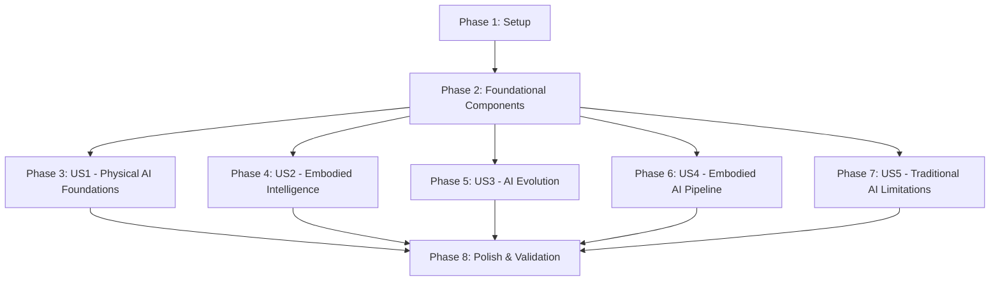

# Implementation Tasks: Chapter 1 - The Rise of Physical AI

**Feature**: 001-chapter-1-physical-ai
**Branch**: `001-chapter-1-physical-ai`
**Created**: 2025-11-28
**Status**: Ready for implementation

## Overview

This document breaks down the implementation of Chapter 1 into executable tasks organized by user story. Each user story represents an independently testable increment that delivers reader value.

**Total Tasks**: 43
**User Stories**: 5 (P1: 2 stories, P2: 2 stories, P3: 1 story)
**Parallelizable Tasks**: 25
**Estimated Time**: 6-8 hours

---

## Task Summary by Phase

| Phase | User Story | Tasks | Parallelizable | Estimated Time |
|-------|-----------|-------|----------------|----------------|
| 1 | Setup | 6 | 3 | 45 min |
| 2 | Foundational (Components) | 8 | 6 | 1.5 hours |
| 3 | US1: Physical AI Foundations | 6 | 3 | 1 hour |
| 4 | US2: Embodied Intelligence | 6 | 3 | 1 hour |
| 5 | US3: AI Evolution | 6 | 3 | 1 hour |
| 6 | US4: Embodied AI Pipeline | 7 | 4 | 1.25 hours |
| 7 | US5: Traditional AI Limitations | 6 | 3 | 1 hour |
| 8 | Polish & Validation | 4 | 2 | 45 min |

---

## Phase 1: Setup (Project Initialization)

**Goal**: Prepare directory structure and configuration for Chapter 1 implementation.

**Tasks**:

- [ ] T001 Create Part 1 directory structure in book-source/docs/part-01/
- [ ] T002 Create Chapter 1 directory structure in book-source/docs/part-01/chapter-01/
- [ ] T003 Create Part 1 category configuration file book-source/docs/part-01/_category_.json
- [ ] T004 Create Chapter 1 category configuration file book-source/docs/part-01/chapter-01/_category_.json
- [ ] T005 [P] Install @docusaurus/theme-mermaid@3.9.2 via npm in book-source/
- [ ] T006 [P] Update docusaurus.config.ts to enable Mermaid diagrams

**Acceptance Criteria**:
- Directory structure matches plan.md specifications
- Category configs validate against contracts/category-schema.json
- Docusaurus dev server shows Part 1 and Chapter 1 in sidebar
- Mermaid support enabled and functional

---

## Phase 2: Foundational (React Components)

**Goal**: Build reusable React components that all lessons will use.

**Why Foundational**: All lessons depend on SummaryButton and PersonalizeButton. Must be complete before lesson content.

**Tasks**:

- [ ] T007 [P] Create SummaryButton component interface following contracts/react-components.ts in book-source/src/components/SummaryButton.tsx
- [ ] T008 [P] Implement SummaryButton component with TypeScript strict mode in book-source/src/components/SummaryButton.tsx
- [ ] T009 [P] Create SummaryButton styles in book-source/src/components/SummaryButton.module.css
- [ ] T010 Add mock summary data for all 5 lessons to SummaryButton component
- [ ] T011 [P] Create PersonalizeButton component interface following contracts/react-components.ts in book-source/src/components/PersonalizeButton.tsx
- [ ] T012 [P] Implement PersonalizeButton component with TypeScript strict mode in book-source/src/components/PersonalizeButton.tsx
- [ ] T013 [P] Create PersonalizeButton styles in book-source/src/components/PersonalizeButton.module.css
- [ ] T014 Test both components in isolation (import and render in test page)

**Acceptance Criteria**:
- Components follow TypeScript interfaces in contracts/react-components.ts
- No TypeScript errors when running `npm run typecheck`
- Components render correctly with mock data
- Styles match dark theme and are responsive
- SummaryButton displays/hides summary on click
- PersonalizeButton shows dropdown with 3 levels (Beginner, Intermediate, Advanced)

**Independent Test**:
Create a test markdown file that imports both components and verify they render and function correctly before proceeding to lesson content.

---

## Phase 3: User Story 1 - Physical AI Foundations (P1)

**Story Goal**: Enable readers to gain foundational understanding of what Physical AI is, why it matters, and how it differs from traditional AI.

**Independent Test**: Reader can complete comprehension quiz covering: (1) definition of Physical AI, (2) key differences from digital AI, (3) why embodiment matters, achieving 80%+ accuracy.

**Tasks**:

- [ ] T015 [US1] Create lesson-01.md file with frontmatter in book-source/docs/part-01/chapter-01/lesson-01.md
- [ ] T016 [US1] Add MDX imports for SummaryButton and PersonalizeButton to lesson-01.md
- [ ] T017 [P] [US1] Write Introduction section (100-150 words) explaining lesson objectives in lesson-01.md
- [ ] T018 [P] [US1] Write Definition and Scope section with 2 H3 subheadings and 2 H4 sub-subheadings per H3 in lesson-01.md
- [ ] T019 [P] [US1] Write Historical Context section with 2 H3 subheadings in lesson-01.md
- [ ] T020 [US1] Write Key Applications Today section with 2 H3 subheadings in lesson-01.md
- [ ] T021 [US1] Add 3 expert insights (:::tip) after each main section in lesson-01.md
- [ ] T022 [US1] Write Key Takeaways section with 3-5 bullet points in lesson-01.md
- [ ] T023 [US1] Validate lesson-01.md word count is 900-1100 words
- [ ] T024 [US1] Validate lesson-01.md heading structure (H1→H2→H3→H4)

**Deliverable**: Complete Lesson 1 markdown file ready for Docusaurus build.

**Acceptance Scenarios**:
1. Reader can articulate what Physical AI is and provide 2-3 real-world examples
2. Reader can explain at least 3 key differences between Physical AI and ChatGPT
3. Reader understands chapter learning objectives and can identify which lesson addresses specific topics

**Parallel Opportunities**:
- T017, T018, T019 can be written in parallel (different sections)
- After content complete, T023 and T024 can run in parallel

---

## Phase 4: User Story 2 - Embodied Intelligence (P1)

**Story Goal**: Enable readers to understand why embodied intelligence is fundamentally different from digital intelligence and essential for true intelligence.

**Independent Test**: Reader can explain why a robot learning to pick up objects learns differently than an LLM learning language, citing 2+ reasons related to physical grounding.

**Tasks**:

- [ ] T025 [US2] Create lesson-02.md file with frontmatter in book-source/docs/part-01/chapter-01/lesson-02.md
- [ ] T026 [US2] Add MDX imports for SummaryButton and PersonalizeButton to lesson-02.md
- [ ] T027 [P] [US2] Write Introduction section (100-150 words) in lesson-02.md
- [ ] T028 [P] [US2] Write Intelligence Beyond Code section with 2 H3 subheadings in lesson-02.md
- [ ] T029 [P] [US2] Write Grounding in Physical World section with 2 H3 subheadings in lesson-02.md
- [ ] T030 [US2] Write Sensorimotor Feedback Loops section with 2 H3 subheadings in lesson-02.md
- [ ] T031 [US2] Add 3 expert insights (:::tip) after each main section in lesson-02.md
- [ ] T032 [US2] Write Key Takeaways section with 3-5 bullet points in lesson-02.md
- [ ] T033 [US2] Validate lesson-02.md word count is 900-1100 words
- [ ] T034 [US2] Validate lesson-02.md heading structure

**Deliverable**: Complete Lesson 2 markdown file.

**Acceptance Scenarios**:
1. Reader can explain why grasping a fragile egg requires embodied intelligence, not just digital computation
2. Reader recognizes role of sensing, feedback, and physical constraints in learning
3. Reader understands limitations of simulation vs. real-world physical learning

**Parallel Opportunities**:
- T027, T028, T029 can be written in parallel (different sections)

---

## Phase 5: User Story 3 - AI Evolution (P2)

**Story Goal**: Enable readers to understand historical progression from LLMs to multimodal systems to embodied action-driven intelligence.

**Independent Test**: Reader can create timeline showing progression from text-only AI → multimodal AI → embodied AI, with at least one example technology for each stage.

**Tasks**:

- [ ] T035 [US3] Create lesson-03.md file with frontmatter in book-source/docs/part-01/chapter-01/lesson-03.md
- [ ] T036 [US3] Add MDX imports for SummaryButton and PersonalizeButton to lesson-03.md
- [ ] T037 [P] [US3] Write Introduction section (100-150 words) in lesson-03.md
- [ ] T038 [P] [US3] Write From Digital AI to Multimodal Systems section with 2 H3 subheadings in lesson-03.md
- [ ] T039 [P] [US3] Write Integrating Action in AI section with 2 H3 subheadings in lesson-03.md
- [ ] T040 [US3] Write Case Studies section with 2 H3 subheadings in lesson-03.md
- [ ] T041 [US3] Add Mermaid timeline diagram showing AI evolution (2018-2025) in lesson-03.md
- [ ] T042 [US3] Add 3 expert insights (:::tip) after each main section in lesson-03.md
- [ ] T043 [US3] Write Key Takeaways section with 3-5 bullet points in lesson-03.md
- [ ] T044 [US3] Validate lesson-03.md word count is 900-1100 words
- [ ] T045 [US3] Validate lesson-03.md heading structure

**Deliverable**: Complete Lesson 3 markdown file with timeline diagram.

**Acceptance Scenarios**:
1. Reader understands capabilities added at each evolution stage (vision, action, embodiment)
2. Reader can distinguish between systems that perceive vs. systems that act
3. Reader can explain why adding "action" to AI models was critical step toward Physical AI

**Parallel Opportunities**:
- T037, T038, T039 can be written in parallel
- T041 (diagram) can be created while writing sections

---

## Phase 6: User Story 4 - Embodied AI Pipeline (P2)

**Story Goal**: Enable readers to learn the core operational loop of Physical AI systems (Perception → Planning → Action) and how components work together.

**Independent Test**: Reader can diagram the Perception-Planning-Action loop for a scenario (e.g., "robot picking an apple") and label each component's role.

**Tasks**:

- [ ] T046 [US4] Create lesson-04.md file with frontmatter in book-source/docs/part-01/chapter-01/lesson-04.md
- [ ] T047 [US4] Add MDX imports for SummaryButton and PersonalizeButton to lesson-04.md
- [ ] T048 [P] [US4] Write Introduction section (100-150 words) in lesson-04.md
- [ ] T049 [P] [US4] Write Perception and Sensing section with 2 H3 subheadings in lesson-04.md
- [ ] T050 [P] [US4] Write Planning and Decision-Making section with 2 H3 subheadings in lesson-04.md
- [ ] T051 [P] [US4] Write Physical Action Execution section with 2 H3 subheadings in lesson-04.md
- [ ] T052 [US4] Add Mermaid pipeline diagram showing Perception→Planning→Action feedback loop in lesson-04.md
- [ ] T053 [US4] Add 3 expert insights (:::tip) after each main section in lesson-04.md
- [ ] T054 [US4] Write Key Takeaways section with 3-5 bullet points in lesson-04.md
- [ ] T055 [US4] Validate lesson-04.md word count is 900-1100 words
- [ ] T056 [US4] Validate lesson-04.md heading structure

**Deliverable**: Complete Lesson 4 markdown file with pipeline diagram.

**Acceptance Scenarios**:
1. Reader understands how raw sensor data becomes environmental understanding
2. Reader can describe how robot plans path considering obstacles and goals
3. Reader recognizes role of feedback loops when execution doesn't match plan
4. Reader can identify which pipeline stage is active at any moment

**Parallel Opportunities**:
- T048, T049, T050, T051 can be written in parallel
- T052 (diagram) can be created while writing sections

---

## Phase 7: User Story 5 - Traditional AI Limitations (P3)

**Story Goal**: Enable readers to understand why classical robotics failed and how modern embodied AI addresses shortcomings.

**Independent Test**: Reader can list 3 limitations of traditional robotics approaches and explain how modern embodied AI solves each one.

**Tasks**:

- [ ] T057 [US5] Create lesson-05.md file with frontmatter in book-source/docs/part-01/chapter-01/lesson-05.md
- [ ] T058 [US5] Add MDX imports for SummaryButton and PersonalizeButton to lesson-05.md
- [ ] T059 [P] [US5] Write Introduction section (100-150 words) in lesson-05.md
- [ ] T060 [P] [US5] Write Limitations of Classical Robotics section with 2 H3 subheadings in lesson-05.md
- [ ] T061 [P] [US5] Write Modern Embodied AI Solutions section with 2 H3 subheadings in lesson-05.md
- [ ] T062 [US5] Write Comparative Analysis section with 2 H3 subheadings in lesson-05.md
- [ ] T063 [US5] Add 3 expert insights (:::tip) after each main section in lesson-05.md
- [ ] T064 [US5] Write Key Takeaways section with 3-5 bullet points in lesson-05.md
- [ ] T065 [US5] Validate lesson-05.md word count is 900-1100 words
- [ ] T066 [US5] Validate lesson-05.md heading structure

**Deliverable**: Complete Lesson 5 markdown file.

**Acceptance Scenarios**:
1. Reader understands why pre-programmed rules are insufficient for complex environments
2. Reader can contrast classical and learning-based robotics paradigms
3. Reader recognizes specific techniques (end-to-end learning, sim-to-real, foundation models) that overcome old limitations

**Parallel Opportunities**:
- T059, T060, T061 can be written in parallel

---

## Phase 8: Polish & Validation

**Goal**: Ensure all content meets quality standards and site builds successfully.

**Tasks**:

- [ ] T067 [P] Run TypeScript type check (`npm run typecheck`) and fix any errors
- [ ] T068 [P] Run Docusaurus build (`npm run build`) and verify all lessons render correctly
- [ ] T069 Test all 5 lessons in local dev server (verify sidebar, TOC, breadcrumbs, components)
- [ ] T070 Validate chapter meets all functional requirements (FR-001 through FR-018 from spec.md)
- [ ] T071 Review content for tone consistency (beginner-friendly yet technical)
- [ ] T072 Check cross-references between lessons for logical flow

**Acceptance Criteria**:
- Build completes with no errors or warnings
- All lessons show correct sidebar position and category labels
- SummaryButton and PersonalizeButton functional in all lessons
- Right TOC shows H2 and H3 headings
- Breadcrumbs display correctly: Home > Part 1 > Chapter 1 > Lesson X
- All lessons meet 900-1100 word count
- All lessons follow H1→H2→H3→H4 heading structure
- All lessons have exactly 3 expert insights
- Dark theme active by default
- Mobile responsive (test at 320px, 768px, 1024px widths)

---

## Dependencies & Execution Order

### Story Dependencies



**Key Insights**:
- **Setup and Foundation are blockers**: Must complete before any user story
- **User Stories 1-5 are independent**: Can be implemented in parallel after Foundation
- **Polish phase depends on all stories**: Wait until all lessons complete

### Recommended Execution Strategy

**Sequential MVP Approach** (Fastest to first deliverable):
1. Phase 1: Setup (T001-T006)
2. Phase 2: Foundation (T007-T014)
3. Phase 3: US1 only (T015-T024) ← **First MVP**
4. Test and validate US1 with readers
5. Implement remaining stories based on feedback

**Parallel Development Approach** (Fastest to full completion):
1. Phase 1: Setup (T001-T006)
2. Phase 2: Foundation (T007-T014)
3. **Parallel**: Assign US1, US2, US3, US4, US5 to different writers/sessions
4. Phase 8: Polish all lessons together

**Recommended for Solo Implementation**:
- Complete Setup and Foundation first
- Implement US1 (P1) and validate with readers
- Implement US2 (P1)
- Implement US3 and US4 (P2) in parallel
- Implement US5 (P3)
- Polish and validate all

---

## Parallel Execution Examples

### Phase 2: Foundational Components

**Parallel Session 1**:
- T007, T008, T009 (SummaryButton)
- T011, T012, T013 (PersonalizeButton)

**Total Time**: 1.5 hours (vs. 3 hours sequential)

### Phase 3-7: User Story Content

**Parallel Session 2** (if multiple writers available):
- Writer A: T015-T024 (US1)
- Writer B: T025-T034 (US2)
- Writer C: T035-T045 (US3)
- Writer D: T046-T056 (US4)
- Writer E: T057-T066 (US5)

**Total Time**: 1.25 hours (vs. 5.25 hours sequential)

### Within Each User Story

**Example: US1 Parallel Execution**:
1. T015-T016 (setup lesson file, imports)
2. **Parallel**: T017, T018, T019, T020 (write all 4 sections simultaneously)
3. T021 (add expert insights)
4. T022 (write key takeaways)
5. **Parallel**: T023, T024 (validate word count and heading structure)

---

## Implementation Strategy

### MVP Scope (Minimum Viable Product)

**MVP = User Story 1 (Lesson 1) Only**

**Rationale**:
- Delivers foundational value (understanding what Physical AI is)
- Tests all infrastructure (components, directory structure, build)
- Enables early reader feedback
- Can be released standalone while other lessons are in progress

**MVP Tasks**: T001-T024 (24 tasks, ~2.5 hours)

**MVP Acceptance**: Reader can explain what Physical AI is and provide 2-3 examples.

### Incremental Delivery

1. **Release 1**: Lesson 1 (US1) - Physical AI Foundations
2. **Release 2**: Lesson 2 (US2) - Embodied Intelligence
3. **Release 3**: Lessons 3-4 (US3-US4) - Evolution and Pipeline
4. **Release 4**: Lesson 5 (US5) - Traditional Limitations
5. **Final Release**: Full Chapter 1 with polish and cross-lesson validation

---

## Validation Checklist

Use this checklist after completing all tasks:

### Content Validation

- [ ] Each lesson has 900-1100 words (excluding frontmatter, imports, admonitions)
- [ ] Each lesson has H1→H2→H3→H4 heading structure (no H5)
- [ ] Each lesson has exactly 3 expert insights (:::tip)
- [ ] Each lesson has 3-5 bullet points in Key Takeaways
- [ ] All technical terms defined before complex usage
- [ ] No placeholder text ([TODO], [PLACEHOLDER], etc.)
- [ ] No AI-generated filler or scaffolding visible

### Technical Validation

- [ ] TypeScript type check passes (`npm run typecheck`)
- [ ] Docusaurus build succeeds (`npm run build`)
- [ ] All lessons render in dev server (`npm run start`)
- [ ] SummaryButton displays/hides summary for all lessons
- [ ] PersonalizeButton shows dropdown with 3 levels
- [ ] Mermaid diagrams render correctly (Lessons 3, 4)

### UX Validation

- [ ] Sidebar shows Part 1 → Chapter 1 → Lessons 1-5
- [ ] Breadcrumbs show Home > Part 1 > Chapter 1 > Lesson X
- [ ] Right TOC displays H2 and H3 headings
- [ ] Dark theme active by default
- [ ] Mobile responsive (320px, 768px, 1024px)
- [ ] Page load time <2 seconds (Lighthouse test)

### Specification Compliance

- [ ] FR-001: Chapter contains exactly 5 lessons ✓
- [ ] FR-002: Each lesson has clear introduction with objectives ✓
- [ ] FR-003: Each lesson has 3-5 main sections (H2) ✓
- [ ] FR-004: Each section has 2+ subheadings (H3) ✓
- [ ] FR-005: Content is beginner-friendly and accurate ✓
- [ ] FR-006: Each lesson includes concrete examples ✓
- [ ] FR-007-011: Each lesson covers specified topic ✓
- [ ] FR-012: Structure reusable for future chapters ✓
- [ ] FR-014: Lessons flow logically ✓
- [ ] FR-015: Technical terms introduced before usage ✓
- [ ] FR-016: Chapter has introduction (handled by Docusaurus generated index)
- [ ] FR-017: Chapter has conclusion (Key Takeaways in each lesson)
- [ ] FR-018: Visual aids included (Mermaid diagrams in Lessons 3, 4)

---

## Task Execution Notes

### File Path Conventions

All file paths are absolute from repository root:
- **Docs**: `book-source/docs/part-01/chapter-01/lesson-{NN}.md`
- **Components**: `book-source/src/components/{ComponentName}.tsx`
- **Styles**: `book-source/src/components/{ComponentName}.module.css`
- **Config**: `book-source/docusaurus.config.ts`

### Word Count Validation

```bash
# Check word count for a lesson (exclude frontmatter, imports, admonitions)
cd book-source/docs/part-01/chapter-01
sed '/^---$/,/^---$/d; /^import/d; /^:::/d' lesson-01.md | wc -w
```

**Target**: 900-1100 words per lesson

### Heading Structure Validation

```bash
# Check heading hierarchy
grep -E '^#{1,4} ' lesson-01.md
```

**Expected Pattern**:
- 1× H1 (`# Lesson Title`)
- 3-5× H2 (`## Section`)
- 2+× H3 per H2 (`### Subheading`)
- 0-2× H4 per H3 (`#### Sub-subheading`)

### Expert Insight Format

```markdown
:::tip Expert Insight
[Four-line explanation of significance, real-world relevance, or deeper context.
Each line should add value and connect theory to practice. Avoid repeating
content from the section above. Focus on why this matters and how it applies
in real-world scenarios.]
:::
```

---

## Success Metrics (from spec.md)

After completing all tasks, measure success against these criteria:

**Content Metrics**:
- SC-001: Reader achieves 80%+ on comprehension quiz (manual testing)
- SC-002: 90% can explain Physical AI vs digital AI differences
- SC-003: Can trace AI evolution with 3+ examples (Lesson 3)
- SC-004: Can describe Perception-Planning-Action pipeline (Lesson 4)
- SC-005: Can identify 3+ traditional limitations and solutions (Lesson 5)

**Quality Metrics**:
- SC-007: 10-15 minute reading time per lesson (word count validation)
- SC-008: 4.5/5 technical accuracy (expert review)
- SC-009: 4/5 clarity for beginners (user testing)
- SC-010: 4/5 example relevance (reader feedback)

**Structural Metrics**:
- SC-006: Chapter structure reusable for future chapters (template adherence)

---

**Status**: ✅ Tasks ready for execution
**Next**: Begin with Phase 1 (Setup) tasks T001-T006
**Estimated Completion**: 6-8 hours for full chapter
**MVP Completion**: 2.5 hours for Lesson 1 only
