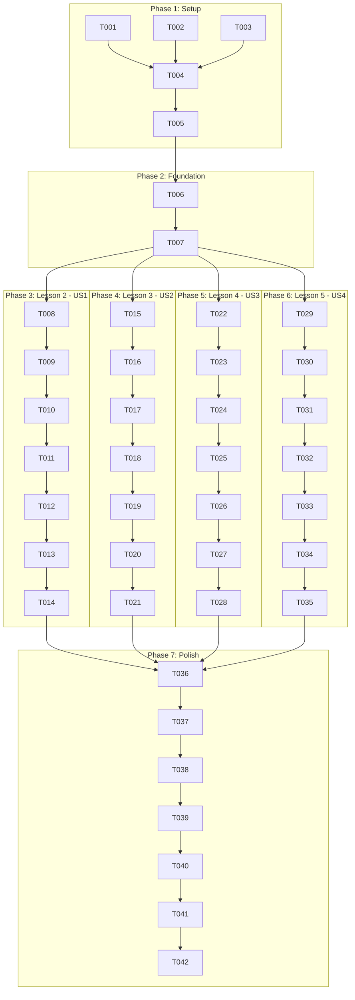

# Tasks: Chapter 1 Lessons 2-5 Content Generation

**Input**: Design documents from `/specs/002-chapter1-lessons-2-5/`  
**Prerequisites**: plan.md ✅, spec.md ✅, research.md ✅, data-model.md ✅, contracts/ ✅, quickstart.md ✅

**Tests**: No automated tests required - content validation via manual review and structural checklist.

**Organization**: Tasks are grouped by user story (each lesson is one user story) to enable independent content generation and validation.

## Format: `[ID] [P?] [Story] Description`

- **[P]**: Can run in parallel (different files, no dependencies)
- **[Story]**: Which user story/lesson this task belongs to (US1=Lesson 2, US2=Lesson 3, US3=Lesson 4, US4=Lesson 5)
- Include exact file paths in descriptions

## Path Conventions

- **Content files**: `book-source/docs/part-01/chapter-01/lesson-XX.md`
- **Spec directory**: `specs/002-chapter1-lessons-2-5/`

---

## Phase 1: Setup (Content Preparation)

**Purpose**: Verify prerequisites and prepare for content generation

- [x] T001 Verify Lesson 1 template exists at `book-source/docs/part-01/chapter-01/lesson-01.md`
- [x] T002 Verify SummaryButton component exists at `book-source/src/components/SummaryButton.tsx`
- [x] T003 Verify PersonalizeButton component exists at `book-source/src/components/PersonalizeButton.tsx`
- [x] T004 Review research.md for content guidelines at `specs/002-chapter1-lessons-2-5/research.md`
- [x] T005 Review data-model.md for content structure at `specs/002-chapter1-lessons-2-5/data-model.md`

**Checkpoint**: ✅ Prerequisites verified - content generation can begin

---

## Phase 2: Foundational (Chapter Structure)

**Purpose**: Ensure chapter navigation and structure is ready

- [x] T006 Verify chapter-01 directory exists at `book-source/docs/part-01/chapter-01/`
- [x] T007 Verify _category_.json exists and includes lessons 2-5 navigation

**Checkpoint**: ✅ Foundation ready - lesson content generation can now begin in parallel

---

## Phase 3: User Story 1 - Lesson 2: Why Embodied Intelligence Matters (Priority: P1) 🎯 MVP

**Goal**: Reader understands why AI needs physical grounding through perception and action with at least 3 concrete robot examples.

**Independent Test**: Open Lesson 2 in Docusaurus, verify ~1200 words, 3 H3 sections, 9 H4 subsections, 9 expert insights, and Key Takeaways section.

### Implementation for User Story 1

- [x] T008 [P] [US1] Create lesson file with frontmatter at `book-source/docs/part-01/chapter-01/lesson-02.md`
  - sidebar_position: 2
  - title: "Lesson 2: Why Embodied Intelligence Matters"
  - description, keywords, slug per template

- [x] T009 [US1] Add imports and header section at `book-source/docs/part-01/chapter-01/lesson-02.md`
  - Import SummaryButton, PersonalizeButton
  - H1 title, component buttons, Overview paragraph

- [x] T010 [US1] Write H3 Section 1: "Importance of Physical Grounding" at `book-source/docs/part-01/chapter-01/lesson-02.md`
  - H4: Sensorimotor Grounding + Expert Insight (Brooks, MIT)
  - H4: Perception-Action Coupling + Expert Insight (Gibson, affordances)
  - H4: Environmental Feedback Loops + Expert Insight (Boston Dynamics)

- [x] T011 [US1] Write H3 Section 2: "Interaction with the Environment" at `book-source/docs/part-01/chapter-01/lesson-02.md`
  - H4: Contact-Rich Manipulation + Expert Insight
  - H4: Dynamic Environment Adaptation + Expert Insight (Spot robot)
  - H4: Multi-Agent Physical Coordination + Expert Insight

- [x] T012 [US1] Write H3 Section 3: "Real-World Learning Challenges" at `book-source/docs/part-01/chapter-01/lesson-02.md`
  - H4: Sim-to-Real Transfer Problems + Expert Insight (OpenAI)
  - H4: Sample Efficiency in Physical Systems + Expert Insight
  - H4: Safety During Learning + Expert Insight

- [x] T013 [US1] Add Conclusion and Key Takeaways at `book-source/docs/part-01/chapter-01/lesson-02.md`
  - Conclusion paragraph with transition to Lesson 3
  - 4-6 bullet point Key Takeaways

- [x] T014 [US1] Validate Lesson 2 structure and word count (~1200 words)

**Checkpoint**: ✅ Lesson 2 complete and independently testable

---

## Phase 4: User Story 2 - Lesson 3: Evolution of AI (Priority: P1)

**Goal**: Reader understands the timeline from LLMs to Vision-Language-Action systems with at least 4 key milestones.

**Independent Test**: Open Lesson 3 in Docusaurus, verify ~1200 words, timeline clarity, and milestone identification (GPT, CLIP, RT-1, RT-2).

### Implementation for User Story 2

- [x] T015 [P] [US2] Create lesson file with frontmatter at `book-source/docs/part-01/chapter-01/lesson-03.md`
  - sidebar_position: 3
  - title: "Lesson 3: Evolution of AI: From LLMs to Vision-Language-Action Systems"
  - description, keywords, slug per template

- [x] T016 [US2] Add imports and header section at `book-source/docs/part-01/chapter-01/lesson-03.md`
  - Import SummaryButton, PersonalizeButton
  - H1 title, component buttons, Overview paragraph

- [x] T017 [US2] Write H3 Section 1: "Digital-Only AI Systems" at `book-source/docs/part-01/chapter-01/lesson-03.md`
  - H4: Text-Based Language Models (GPT, BERT) + Expert Insight (2017-2020)
  - H4: Image Recognition Systems + Expert Insight (ImageNet, ResNet)
  - H4: Limitations of Disembodied AI + Expert Insight

- [x] T018 [US2] Write H3 Section 2: "Multimodal Intelligence Integration" at `book-source/docs/part-01/chapter-01/lesson-03.md`
  - H4: Vision-Language Models (CLIP, GPT-4V) + Expert Insight (2021-2023)
  - H4: Cross-Modal Reasoning + Expert Insight
  - H4: Grounding Language in Perception + Expert Insight

- [x] T019 [US2] Write H3 Section 3: "Action-Oriented Embodied AI" at `book-source/docs/part-01/chapter-01/lesson-03.md`
  - H4: Vision-Language-Action (VLA) Models + Expert Insight
  - H4: RT-1, RT-2, and Foundation Models for Robotics + Expert Insight (Google DeepMind)
  - H4: The Future of Embodied Foundation Models + Expert Insight (OpenVLA, 2024)

- [x] T020 [US2] Add Conclusion and Key Takeaways at `book-source/docs/part-01/chapter-01/lesson-03.md`
  - Conclusion paragraph with transition to Lesson 4
  - 4-6 bullet point Key Takeaways

- [x] T021 [US2] Validate Lesson 3 structure and word count (~1200 words)

**Checkpoint**: ✅ Lesson 3 complete and independently testable

---

## Phase 5: User Story 3 - Lesson 4: Embodied AI Pipeline (Priority: P1)

**Goal**: Reader understands the Perception → Planning → Action pipeline with examples, challenges, and modern approaches for each stage.

**Independent Test**: Open Lesson 4 in Docusaurus, verify ~1200 words, clear pipeline explanation, and at least one challenge + modern approach per stage.

### Implementation for User Story 3

- [x] T022 [P] [US3] Create lesson file with frontmatter at `book-source/docs/part-01/chapter-01/lesson-04.md`
  - sidebar_position: 4
  - title: "Lesson 4: The Embodied AI Pipeline: Perception → Planning → Action"
  - description, keywords, slug per template

- [x] T023 [US3] Add imports and header section at `book-source/docs/part-01/chapter-01/lesson-04.md`
  - Import SummaryButton, PersonalizeButton
  - H1 title, component buttons, Overview paragraph

- [x] T024 [US3] Write H3 Section 1: "Perception Systems in Robotics" at `book-source/docs/part-01/chapter-01/lesson-04.md`
  - H4: Sensor Fusion (Camera, LiDAR, Proprioception) + Expert Insight
  - H4: Scene Understanding and Object Detection + Expert Insight (YOLO, ViT)
  - H4: Semantic and Spatial Representations + Expert Insight (NeRF, 3D Gaussians)

- [x] T025 [US3] Write H3 Section 2: "Planning and Decision-Making" at `book-source/docs/part-01/chapter-01/lesson-04.md`
  - H4: Classical Motion Planning (RRT, A*) + Expert Insight (MoveIt, OMPL)
  - H4: Learning-Based Planning + Expert Insight (diffusion planning)
  - H4: Hierarchical Task Planning + Expert Insight (SayCan, Code-as-Policies)

- [x] T026 [US3] Write H3 Section 3: "Action Execution and Feedback" at `book-source/docs/part-01/chapter-01/lesson-04.md`
  - H4: Low-Level Motor Control + Expert Insight (PID, MPC)
  - H4: Closed-Loop Control and Error Correction + Expert Insight
  - H4: Reinforcement Learning for Control + Expert Insight (IsaacGym, Diffusion Policy)

- [x] T027 [US3] Add Conclusion and Key Takeaways at `book-source/docs/part-01/chapter-01/lesson-04.md`
  - Conclusion paragraph with transition to Lesson 5
  - 4-6 bullet point Key Takeaways

- [x] T028 [US3] Validate Lesson 4 structure and word count (~1200 words)

**Checkpoint**: ✅ Lesson 4 complete and independently testable

---

## Phase 6: User Story 4 - Lesson 5: Traditional Physical AI Falls Short (Priority: P2)

**Goal**: Reader understands at least 3 limitations of classical robotics and how modern embodied AI methods address each.

**Independent Test**: Open Lesson 5 in Docusaurus, verify ~1200 words, clear limitation explanations, and modern solutions with examples.

### Implementation for User Story 4

- [x] T029 [P] [US4] Create lesson file with frontmatter at `book-source/docs/part-01/chapter-01/lesson-05.md`
  - sidebar_position: 5
  - title: "Lesson 5: Traditional Physical AI Falls Short"
  - description, keywords, slug per template

- [x] T030 [US4] Add imports and header section at `book-source/docs/part-01/chapter-01/lesson-05.md`
  - Import SummaryButton, PersonalizeButton
  - H1 title, component buttons, Overview paragraph

- [x] T031 [US4] Write H3 Section 1: "Limitations of Classical Robotics" at `book-source/docs/part-01/chapter-01/lesson-05.md`
  - H4: Rigid Programming and Lack of Flexibility + Expert Insight (industrial arms)
  - H4: Model Dependency and Brittleness + Expert Insight (DARPA Challenge)
  - H4: Manual Engineering Bottlenecks + Expert Insight

- [x] T032 [US4] Write H3 Section 2: "Challenges in Unstructured Environments" at `book-source/docs/part-01/chapter-01/lesson-05.md`
  - H4: Variability and Uncertainty + Expert Insight
  - H4: Novel Object Handling + Expert Insight
  - H4: Human-Robot Interaction Challenges + Expert Insight

- [x] T033 [US4] Write H3 Section 3: "Modern Embodied AI Solutions" at `book-source/docs/part-01/chapter-01/lesson-05.md`
  - H4: Learning from Demonstration + Expert Insight (Mobile ALOHA, ALOHA 2)
  - H4: Foundation Models for Generalization + Expert Insight (PaLM-E, RT-2)
  - H4: End-to-End Learned Policies + Expert Insight (Diffusion Policy, ACT)

- [x] T034 [US4] Add Conclusion and Key Takeaways at `book-source/docs/part-01/chapter-01/lesson-05.md`
  - Conclusion paragraph with chapter wrap-up and forward to Chapter 2
  - 4-6 bullet point Key Takeaways

- [x] T035 [US4] Validate Lesson 5 structure and word count (~1200 words)

**Checkpoint**: ✅ Lesson 5 complete and independently testable

---

## Phase 7: Polish & Cross-Cutting Concerns

**Purpose**: Final validation and integration testing

- [x] T036 Run Docusaurus build to verify all lessons render: `cd book-source && npm run build`
- [x] T037 Verify sidebar navigation shows Lessons 1-5 in order
- [x] T038 Verify all internal links work (transition statements)
- [x] T039 Review all lessons for consistent tone and style
- [x] T040 Final word count verification (each lesson 1100-1300 words)
- [x] T041 Verify no placeholder text or [TODO] markers remain
- [x] T042 Update requirements.md checklist with completion status at `specs/002-chapter1-lessons-2-5/checklists/requirements.md`

**Checkpoint**: ✅ All lessons complete, validated, and integrated

---

## Dependencies

## Parallel Execution Opportunities

### Lesson Creation (After Phase 2)
All four lesson file creations can run in parallel:
- T008 [P] [US1] Create lesson-02.md
- T015 [P] [US2] Create lesson-03.md
- T022 [P] [US3] Create lesson-04.md
- T029 [P] [US4] Create lesson-05.md

### Full Lesson Generation (After respective file creation)
Once a lesson file is created, its entire content generation can proceed independently:
- US1 (Lesson 2): T009 → T010 → T011 → T012 → T013 → T014
- US2 (Lesson 3): T016 → T017 → T018 → T019 → T020 → T021
- US3 (Lesson 4): T023 → T024 → T025 → T026 → T027 → T028
- US4 (Lesson 5): T030 → T031 → T032 → T033 → T034 → T035

**Maximum Parallelism**: 4 lessons can be written simultaneously by different workers.

---

## Implementation Strategy

### MVP Scope (Recommended First Delivery)
**User Story 1 only**: Complete Lesson 2 first
- Tasks: T001-T014
- Delivers: Fully functional Lesson 2 that readers can access
- Validates: Template approach, content quality, structure compliance

### Incremental Delivery
1. **Increment 1**: Lesson 2 (US1) - MVP
2. **Increment 2**: Lesson 3 (US2) - Adds timeline context
3. **Increment 3**: Lesson 4 (US3) - Adds technical pipeline
4. **Increment 4**: Lesson 5 (US4) - Completes chapter narrative
5. **Increment 5**: Polish phase - Final validation

### Estimated Effort

| Phase | Tasks | Est. Time |
|-------|-------|-----------|
| Setup | T001-T005 | 5 min |
| Foundation | T006-T007 | 2 min |
| Lesson 2 (US1) | T008-T014 | 20-30 min |
| Lesson 3 (US2) | T015-T021 | 20-30 min |
| Lesson 4 (US3) | T022-T028 | 20-30 min |
| Lesson 5 (US4) | T029-T035 | 20-30 min |
| Polish | T036-T042 | 15 min |
| **Total** | 42 tasks | ~2-2.5 hours |

---

## Summary

| Metric | Value |
|--------|-------|
| Total Tasks | 42 |
| Setup Tasks | 7 (T001-T007) |
| US1 Tasks (Lesson 2) | 7 (T008-T014) |
| US2 Tasks (Lesson 3) | 7 (T015-T021) |
| US3 Tasks (Lesson 4) | 7 (T022-T028) |
| US4 Tasks (Lesson 5) | 7 (T029-T035) |
| Polish Tasks | 7 (T036-T042) |
| Parallel Opportunities | 4 (lesson file creation) |
| MVP Scope | US1 (Lesson 2 only) |
